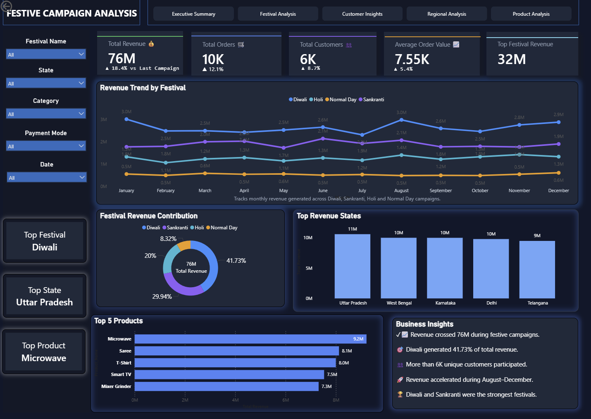

# 🎉 Festive Campaign Analysis Dashboard

## 📌 Project Overview

The **Festive Campaign Analysis Dashboard** is a data analytics project that evaluates the performance of major Indian festive campaigns across retail stores. Using SQL for data analysis and Power BI for visualization, the dashboard provides insights into sales performance, customer purchasing behavior, product demand, and regional trends.

The goal of this project is to demonstrate practical data analytics skills including data cleaning, SQL querying, business intelligence reporting, and dashboard creation.

---

## 🎯 Business Problem

Retail organizations invest heavily in festive marketing campaigns to increase revenue and customer engagement. However, understanding which campaigns, products, customer segments, and regions drive the highest performance remains a challenge.

This project aims to answer key business questions such as:

* Which festivals generate the highest revenue?
* Which products and categories perform best during campaigns?
* Which customer segments contribute the most sales?
* Which regions and stores drive maximum revenue?
* Which payment methods are most preferred by customers?
* How can future campaigns be optimized for better performance?

---

## 🛠️ Tools & Technologies Used

**SQL (MySQL)** – Data querying and analysis
**Power BI** – Interactive dashboard and data visualization
**Excel** – Dataset creation and preparation
**Python (Pandas & Matplotlib)** – Exploratory data analysis
**DAX** – KPI calculations and business metrics

---

## 📂 Dataset Information
The dataset contains sales transactions collected from **50,000+ retail transactions** across multiple Indian stores.


### Sales Transactions
* Transaction ID
* Date
* Store ID
* Customer ID
* Product ID
* Quantity
* Revenue
* Discount
* Festival Name
* Payment Mode

### Products
* Product Name
* Category
* Brand
* Price

### Customers
* Age Group
* Gender
* Loyalty Status

### Stores
* City
* State
* Region
* Store Type

The datasets were imported into MySQL for SQL analysis and then connected to Power BI for dashboard development.

---

## 📊 Key Dashboard Metrics

The dashboard highlights important KPIs including:

* Total Revenue
* Total Orders
* Total Customers
* Average Order Value
* Revenue Growth %
* Total Products Sold
* Top Performing Festival
* Top Revenue Generating State

---

## 📈 Dashboard Visualizations

The Power BI dashboard includes the following visual insights:

### Executive Summary

* Revenue KPI Cards
* Orders KPI Cards
* Customer KPI Cards
* Revenue Trend Analysis

### Festival Analysis

* Revenue by Festival
* Festival-wise Order Distribution
* Festival Performance Comparison

### Product Analysis

* Top Performing Products
* Revenue by Category
* Revenue by Brand

### Customer Analysis

* Revenue by Gender
* Revenue by Age Group
* Loyalty Customer Contribution

### Regional Analysis

* Revenue by State
* Revenue by Region
* Top Performing Cities
* Store Performance Analysis

### Payment Analysis

* Revenue by Payment Mode
* Order Distribution by Payment Method

### Interactive Filters

Users can dynamically filter the dashboard by:

* Festival
* State
* Region
* Product Category
* Store Type
* Payment Mode

The dashboard is designed using a modern business intelligence layout with interactive navigation and dynamic filtering.

---

## 💻 SQL Analysis Queries

### Total Revenue

```sql
SELECT ROUND(SUM(Revenue),2) AS Total_Revenue
FROM sales_transactions;
```

### Revenue by Festival

```sql
SELECT
`Festival Name`,
ROUND(SUM(Revenue),2) AS Revenue
FROM sales_transactions
GROUP BY `Festival Name`
ORDER BY Revenue DESC;
```

### Top Products

```sql
SELECT
p.Product_Name,
ROUND(SUM(s.Revenue),2) AS Revenue
FROM sales_transactions s
JOIN products p
ON s.Product_ID = p.Product_ID
GROUP BY p.Product_Name
ORDER BY Revenue DESC
LIMIT 10;
```

### Revenue by State

```sql
SELECT
st.State,
ROUND(SUM(s.Revenue),2) AS Revenue
FROM sales_transactions s
JOIN stores st
ON s.Store_ID = st.Store_ID
GROUP BY st.State
ORDER BY Revenue DESC;
```

---

## 🔍 Key Insights from the Analysis

* Diwali generated the highest overall revenue among all festive campaigns.
* Electronics emerged as the highest revenue-generating product category.
* Loyal customers contributed a significant share of total revenue.
* UPI was the most preferred payment method among customers.
* Metro cities consistently outperformed smaller markets during festive periods.
* South Indian regions demonstrated strong spending patterns during Sankranti campaigns.
* Festive campaign periods significantly outperformed normal sales periods.

---

## 📋 Project Workflow

1. Created and prepared datasets in Excel
2. Imported datasets into MySQL database
3. Performed SQL analysis and KPI calculations
4. Connected data to Power BI
5. Built a star schema data model
6. Created DAX measures and business KPIs
7. Developed interactive dashboards
8. Generated business insights and recommendations
9. Published dashboard using Power BI Service

---

## 📷 Dashboard Preview

### Executive Dashboard

()


---

## 💡 Business Recommendations

### Increase Investment in High-Performing Festivals
Allocate larger marketing budgets toward campaigns with proven revenue impact.

### Strengthen Loyalty Programs
Offer personalized promotions and rewards to increase repeat purchases.

### Expand High-Demand Product Categories
Ensure sufficient inventory for top-performing products during festive periods.

### Focus on Regional Marketing
Develop region-specific campaigns based on local purchasing behavior.

### Promote Digital Payments
Encourage UPI and card payments through targeted incentives and cashback offers.

---

## 📊 Project Impact

* Analyzed **50,000+ retail transactions**
* Built an interactive Power BI dashboard
* Developed SQL-based business KPI framework
* Identified customer purchasing trends
* Uncovered product and regional performance patterns
* Delivered actionable business recommendations for future campaigns

---

## 👨‍💻 Author
**Umang Singh**
B.Tech Computer Science Student | Aspiring Data Analyst
---

## ⭐ Project Purpose
This project was created as part of a Data Analytics portfolio to demonstrate skills in:

* SQL Data Analysis
* Data Cleaning & Transformation
* Business Intelligence Reporting
* Power BI Dashboard Development
* Data Visualization
* Business Insight Generation
* Data-Driven Decision Making
